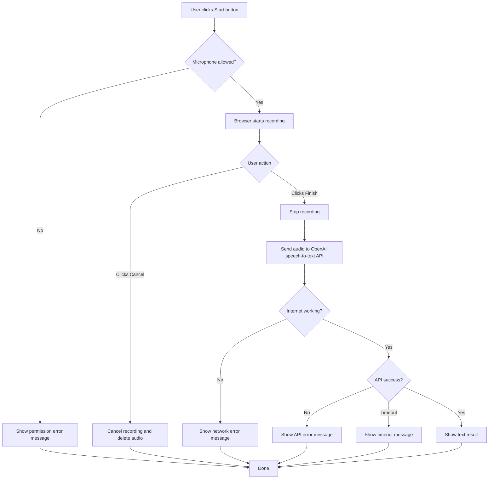

# BASED TRANSLATOR
01. Speech-to-text translator using the OpenAI API. No server-side storage - everything stays in your browser.
02. Users bring their own OpenAI token, and everything stays in the user's browser.
03. It uses pnpm, plain TypeScript, and Vite.


## 1. Project Structure
01. `package.json`: for pnpm.
02. `tsconfig.json`: for TypeScript.
03. `vite.config.ts`: for Vite.
04. `src/`: project source files.
05. `.editorconfig`: project coding style.


## 2. UI/UX
01. OpenAI API key input form.
02. Start button.
03. Finish button.
04. Cancel button.
05. Translation text label.
06. Dark theme and minimal design.
07. Use monospace font.
08. Use ASCII characters for design.


## 3. Logic Flow




## 4. Rules
01. Let's use simple and easy-to-understand codes.
02. Let's have comments so that other dev frens understand the codes super easy.
03. Use single-source-of-truth approach.
04. Add semicolons in the source codes.


## 5. Build / Run / Test
01. Build: `$ pnpm run build`
02. Run: `$ pnpm run dev`
03. Test: No test needed because this is a simple project.


## 6. OpenAI Speech To Text
01. The project uses OpenAI's speech-to-text API.
02. Example code from the official document:

```js
import fs from "fs";
import OpenAI from "openai";

const openai = new OpenAI();

const transcription = await openai.audio.transcriptions.create({
	file: fs.createReadStream("/path/to/file/speech.mp3"),
	model: "gpt-4o-transcribe",
	response_format: "text",
});

console.log(transcription.text);
```

03. The example code uses `.mp3`, but we use in-memory in browser.
