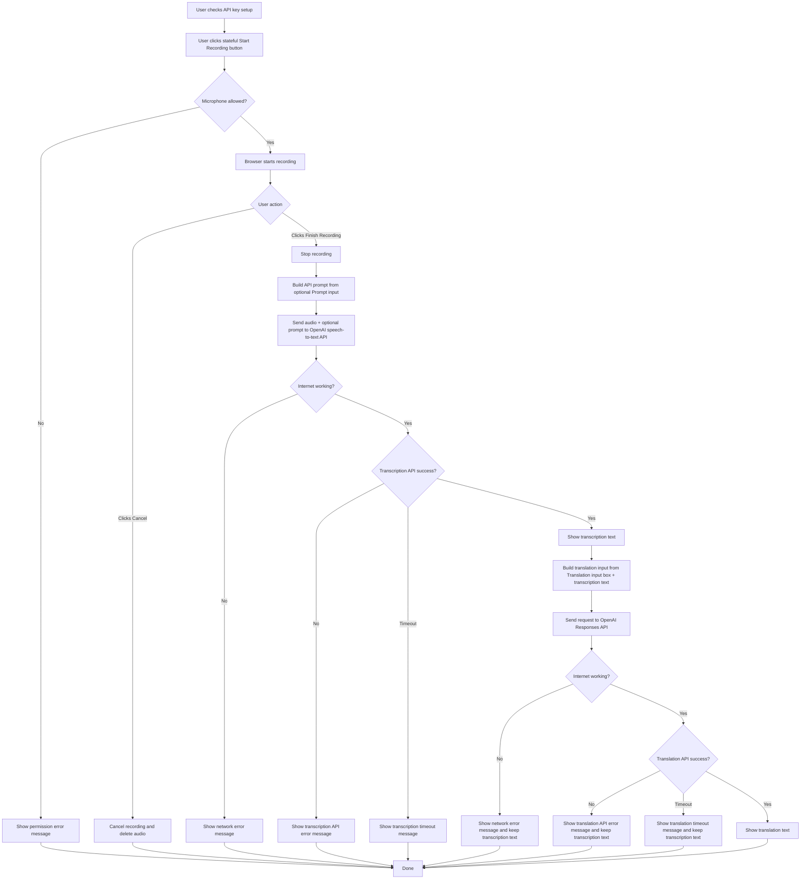

# BASED TRANSLATOR
01. Speech-to-text + translation app using the OpenAI API. No server-side storage - everything stays in your browser.
02. Users bring their own OpenAI token, and everything stays in the user's browser.
03. It uses pnpm, plain TypeScript, and Vite.


## 1. Project Structure
01. `package.json`: for pnpm.
02. `tsconfig.json`: for TypeScript.
03. `vite.config.ts`: for Vite.
04. `src/`: project source files.
05. `.editorconfig`: project coding style.


## 2. UI/UX
01. OpenAI API key input form.
02. Save API Key button.
03. One stateful recording button:
	03-01. Idle: `[ Start Recording ]`
	03-02. Recording: `[ Finish Recording ]`
	03-03. Transcribing / Translating: disabled with phase label.
04. Cancel button shown only while recording.
05. Compact single-line status text.
06. Advanced panel (`<details>`) for optional settings.
07. Prompt text input (optional) inside Advanced panel.
08. Translation input text box (instructions for translation) inside Advanced panel.
09. Two equal output panels:
	09-01. Transcription text label + output box.
	09-02. Translation text label + output box.
10. Dark theme and minimal design.
11. Use monospace font.
12. Use ASCII-style labels/components where practical.


## 3. Logic Flow




### 3-1. Implementation Notes
01. Prompt text is optional and persisted in browser localStorage.
02. Prompt localStorage key: `based_translator_prompt`.
03. API key localStorage key: `based_translator_openai_api_key`.
04. Translation input is persisted in browser localStorage.
05. Translation input localStorage key: `based_translator_translation_input`.
06. Advanced panel open/closed state is persisted in browser localStorage.
07. Advanced panel localStorage key: `based_translator_advanced_open`.
08. API key input, Save button, prompt input, and translation input are disabled while recording/transcribing/translating.
09. Advanced panel toggle is locked while recording/transcribing/translating.
10. Transcription request timeout is 60 seconds.
11. Translation request timeout is 60 seconds.
12. Transcription payload always includes `file` and `model`, and includes `prompt` only when non-empty.
13. Translation payload uses Responses API with `model: ...` and `input`.
14. Translation output parsing should support both `output_text` and nested `output[].content[].text`.
15. On cancel, audio/transcription/translation are cleared.
16. On translation error, transcription stays visible.


## 4. Rules
01. Let's use simple and easy-to-understand codes.
02. Let's have comments so that other dev frens understand the codes super easy.
03. Use single-source-of-truth approach.
04. Add semicolons in the source codes.


## 5. Build / Run / Test
01. Build: `$ pnpm run build`
02. Run: `$ pnpm run dev`
03. Test: No test needed because this is a simple project.


## 6. OpenAI APIs
01. The project uses OpenAI's APIs.
02. After transcription succeeds, the project sends another request to OpenAI Responses API to translate text.


### 6-1. Speech To Text API
01. Example code from the official document:

```js
import fs from "fs";
import OpenAI from "openai";

const openai = new OpenAI();

const transcription = await openai.audio.transcriptions.create({
	file: fs.createReadStream("/path/to/file/speech.mp3"),
	model: "gpt-4o-transcribe",
	response_format: "text",
	prompt:"...",
});

console.log(transcription.text);
```

02. The example code uses `.mp3`, but we use in-memory in browser.


### 6-2. Text Generation API (Translation)
01. Example code from the official document:

```js
import OpenAI from "openai";
const client = new OpenAI();

const response = await client.responses.create({
	model: "gpt-5.2",
	input: "..."
});

console.log(response.output_text);
```

02. `input` is built from:
	02-01. translation instructions from the translation text input.
	02-02. transcription text from speech-to-text result.
