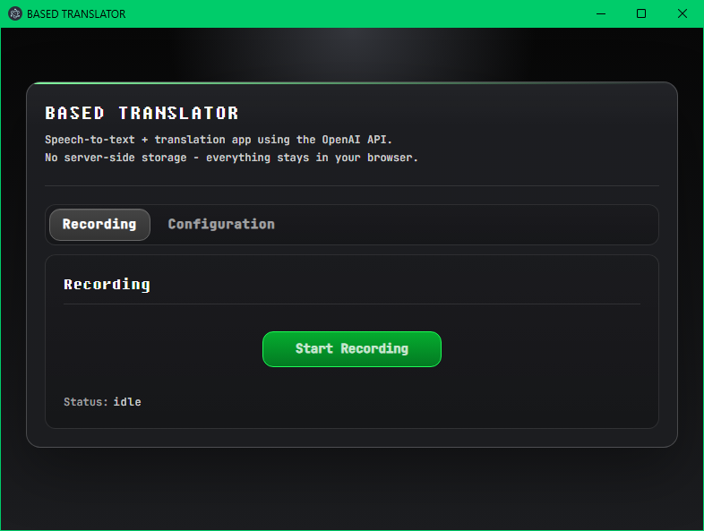

# BASED TRANSLATOR

<p align="center">
	
</p>

Speech-to-text + translation app using the OpenAI API.
No server-side storage - everything stays in user's browser.

This project is built by Codex CLI, Codex CLI only.


## Privacy
01. Everything runs in your browser.
02. API key and prompts are saved only in your browser `localStorage`.
03. There is no backend database in this project.
04. The web app is sandboxed from native wrapper logic.


## App Overview
01. `src/01_webapp/` is the main app.
02. The web app is sandboxed.
03. The web app works without the Electron wrapper.
04. `src/02_electron/` is the native desktop wrapper.
05. The Electron app is mainly for building a Windows `.exe`.
06. The Electron app also adds one OS-native feature: the translation output can follow the mouse cursor globally.


## Project Structure
01. `01_release/`: screenshots, versioned notes and prompts for major app changes.
02. `src/01_webapp/`: standalone web app built with plain TypeScript, HTML, CSS, and Vite.
03. `src/02_electron/`: Electron wrapper for packaging and native desktop behavior.
04. `.editorconfig`: shared formatting rules for the repo.
05. `AGENTS.md`: project instructions for Codex, including architecture, rules, and workflow notes.
06. `package.json`: root command entry that controls the web app and Electron app scripts.


## Coding Philosophy
01. We stick to the vanilla version because we want to use tools as the creators intended.
02. We keep dependencies minimal because we want full control over the project.
03. We use a structure that is easy for humans to understand, because we are not bots - we are human.
04. We use the default setup when possible, so large framework migrations are easier to handle later.


## Default Tool Setup
01. The web app structure follows the default Vite CLI vanilla TypeScript setup as the reference baseline.

```bash
$ npm create vite@8.3.0 myapp -- --template vanilla-ts
```

02. The Electron app structure follows the default Electron Forge Vite TypeScript setup as the reference baseline.

```bash
$ npx create-electron-app@7.11.1 myapp --template=vite-typescript
```


## Quick Start
```bash
# Install the web app packages
$ npm run webapp:install

# Start the web app dev server
$ npm run webapp:dev
# Then, open: `http://localhost:9999`


# Build the web app
$ npm run webapp:build
```


## Electron Workflow
```bash
# Install the Electron packages
$ npm run electron:install

# Start the Electron app in dev mode
$ npm run electron:dev


# Package the Electron app
$ npm run electron:build
```

During development, the Electron-built `.exe` file will be built manually in a Windows environment.
This repo is developed in Linux, so the Windows desktop build flow is handled manually for now.

Once the app becomes more stable and more useful, we plan to add an automated build process through a GitHub task.


## Notes
01. The web app owns the main app logic.
02. The Electron app stays wrapper-specific.
03. The web app and the Electron app are separated on purpose.
04. This keeps the browser app portable and easier to maintain.


## TODOs
01. Electron build automation (via GitHub task).
02. Electron app icon.
03. Scripts for automation.
04. Header/footer.
