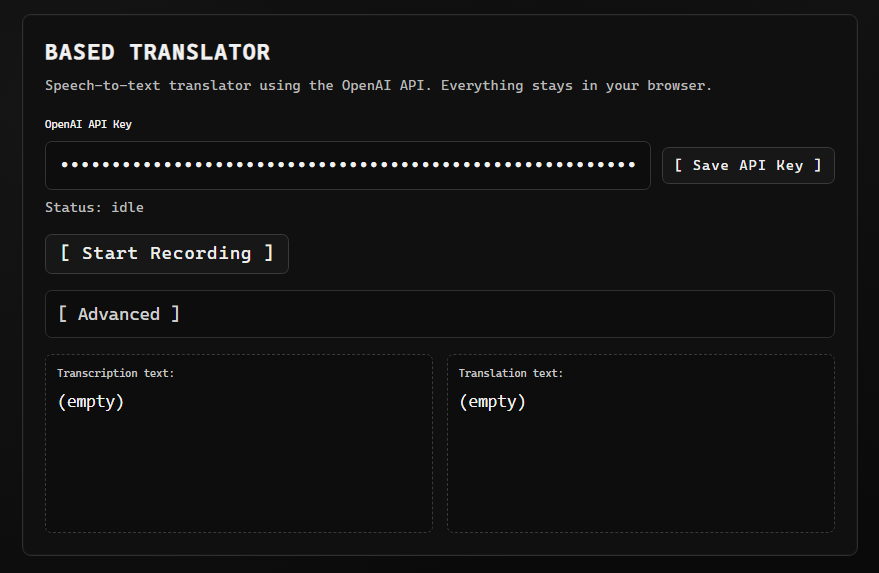

# BASED TRANSLATOR

<p align="center">
	
</p>

Speech-to-text + translation app using the OpenAI API.
No server-side storage. Everything stays in your browser.


## What It Does
- Takes microphone audio in the browser.
- Sends audio to OpenAI Speech-to-Text API (`/v1/audio/transcriptions`).
- Sends transcription text to OpenAI Responses API (`/v1/responses`) for translation.
- Shows transcription and translation side-by-side.


## Behavior Notes
- API key, prompt, translation instructions, and advanced panel open/closed state are saved in `localStorage`.
- Inputs and advanced toggle are locked while recording/transcribing/translating.
- On cancel, recording data and outputs are cleared.
- On translation error, transcription stays visible.
- Request timeout is `60s` for both transcription and translation.


## Run
```bash
pnpm install
pnpm run dev
```


## Build
```bash
pnpm run build
```


## Security Note
- API key is stored in your browser `localStorage` for this origin.
- Use a dedicated key with scoped limits when possible.
