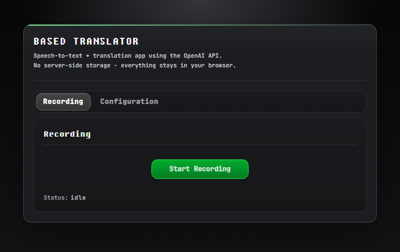

# BASED TRANSLATOR

<p align="center">
	
</p>

Speech-to-text + translation app using the OpenAI API.
No server-side storage - everything stays in user's browser.


## Privacy
1. Everything runs in your browser.
2. API key and prompts are saved only in your browser `localStorage`.
3. There is no backend database in this project.


## Quick Start
```bash
# Dev
$ pnpm install
$ pnpm run dev
# Then, open: `http://localhost:9999`


# Build
$ pnpm run build
```
